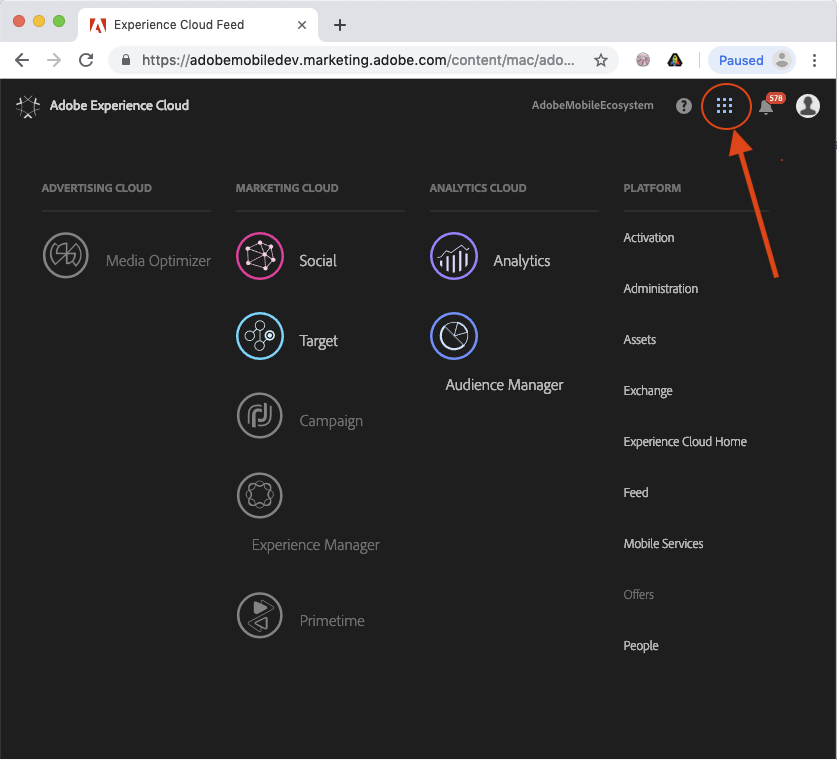
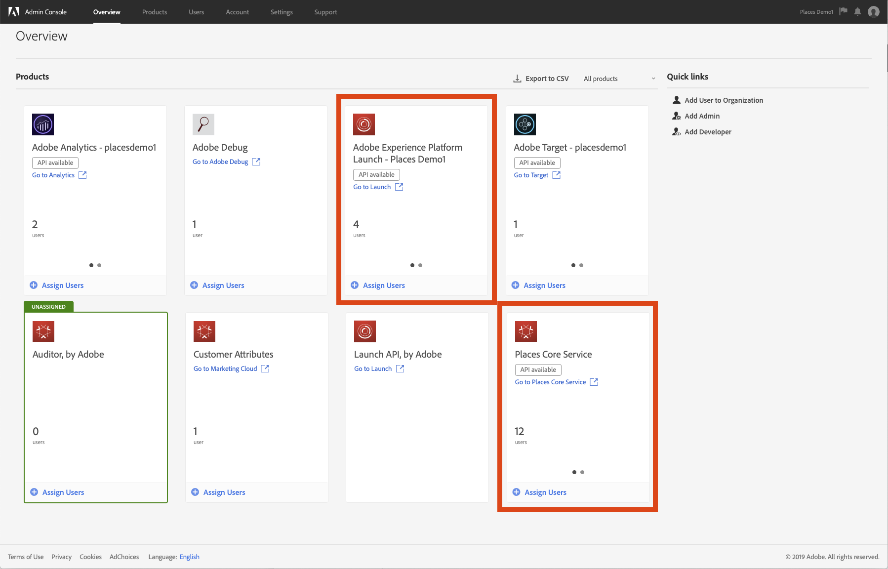

# Adding a user to Experience Platform Location Services and Experience Platform Launch {#adding-user-launch-places}

To allow users to access places.adobe.com, they need to be added to Experience Platform Location Services Core Service in the Admin Console as a user. To allow users to have access to Adobe Experience Platform Launch, configure mobile properties, and use Experience Platform Location Services with the Adobe Experience Platform SDK, they need to be added to Experience Platform Launch in the Admin Console and be given the following permissions for Experience Platform Launch:

* All Property Rights:
  * Develop
  * Approve
  * Publish
  * Manage extensions
  * Manage environments
* Manage Properties permission under Company Rights 

If this is the first time you are adding a user, complete the following steps to add users to Launch and Places. If you have added users before, multiple profiles might be displayed, so ensure that you select the correct profile.

>[!IMPORTANT]
>
>Only org administrators can access the Admin Console and add the users.

## 1. Verify that Experience Platform Location Services and Adobe Experience Platform Launch are provisioned 

To verify that Experience Platform Location Services and Adobe Experience Platform Launch are provisioned:

1. Log in to your Experience Cloud organization.
1. In the top-right side, click the Experience Cloud shell switcher.

    

1. Under **[!UICONTROL Platform]**, click **[!UICONTROL Administration]**.

   If you do not see **Administration** in the list, you are not an admin. You must contact your org admin to complete this procedure.

1. In the Experience Cloud Administration page, on the **[!UICONTROL Admin Console]** card, click **[!UICONTROL Take me there]**.

1. In the Admin Console, if you have access to several organizations, verify that the correct organization is selected in the top right side of the page. 

    This is the organization to which you will add your users. If the correct org has not been selected, click on the org and select the org from the drop-down list.   

    >[!IMPORTANT]
    >
    >If you do not have access to an organization, it means that you do not have admin access to that organization.

1. Verify that the cards for **[!UICONTROL Adobe Experience Platform Launch]** and **[!UICONTROL Places Core Services]** are displayed.

    

    If they are displayed, Experience Platform Location Services and Experience Platform Launch have been provisioned for your organization. If they are not displayed, they have not been provisioned for your organization.

    >[!IMPORTANT]
    >
    >During the Beta period, after you complete the [Beta survey](https://forms.office.com/Pages/ResponsePage.aspx?id=Wht7-jR7h0OUrtLBeN7O4fkr821yYptFo-ghlnlXCyhUM0dQVkJCSzVDMFNGWEFXWUUwNEJWSjhSRS4u), the request is made to the Provisioning team.

## 2. Set up the profile and add the permissions

To set up the profile and add the permissions:

1. Set up a Experience Platform Launch profile, which allows the users who were added to the profile, use Experience Platform Launch and its mobile properties with the Experience Platform SDK.

   a. In the menu bar, click **[!UICONTROL Product]**.

   b. In the left pane, in the list of products, click **[!UICONTROL Adobe Experience Platform Launch]**.

     * The Experience Platform Launch profile(s) appear on the right.
     * Experience Platform Launch has a default profile called *Launch - (org name)* . 
  
       If you previously added users to Experience Platform Launch, you might see multiple profiles listed.

2. Select the correct profile:

   a. Click on the name of the default profile.

   b. Click the **[!UICONTROL Permissions]** tab.

   c. Click **[!UICONTROL Edit]** next to **[!UICONTROL Property Rights]**.

   d. In the left pane, click **[!UICONTROL + Add all]**.

      This step moves all of the available permissions to the included permissions list.

   e. Click **[!UICONTROL Company Rights]**.

   f. In the left pane, click **[!UICONTROL + Manage Properties]**.

   g. Click **[!UICONTROL Save]**.

>[!IMPORTANT]
>
>For Experience Platform Location Services, there is a default profile, but you do not have to add any permissions. 

You have successfully added permissions to the profile that you created.

## 3. Add a user or a developer to your Experience Platform Location Services and Adobe Experience Platform Launch profiles

You can add a user and/or a developer to your Experience Platform Location Services and Experience Platform Launch profiles.

### Add a user

To add a user to your Experience Platform Location Services and Experience Platform Launch profiles:

1. Add a user to the Experience Platform Launch profile.

   a. In the menu bar, click **[!UICONTROL Overview]**.

   b. On the **[!UICONTROL Adobe Experience Platform Launch]** card, verify the following:

   * Two dots are displayed at the bottom of the card.
   * The dot on the left is black.

     If the dot on the right side is black, you can only add developers. To add a user, click the dot on the left.

   c. Click **[!UICONTROL + Add Users]**.

   d. Enter the user’s Adobe ID.

   e. Complete one of the following steps:

      * If you are adding a new user, click **[!UICONTROL New user]**, and enter the user’s first and last name.
      * If you are adding an existing user, click the user’s name that is displayed.

   f. In the **[!UICONTROL Please select a profile for this product]** drop-down list, select the profile that you edited earlier.

   g. Click **[!UICONTROL Save]**.

2. Add a user to **[!UICONTROL Places Core Services]**.

   >[!TIP]
   >
   >Currently, all Experience Platform Location Services users have the same permissions, so you do not need to edit the permissions.

   a. On the **[!UICONTROL Places Core Services]** card, verify the following:

   * Two dots are displayed at the bottom of the card.
   * The dot on the left is black.

   b. Click **[!UICONTROL + Assign Users]**.

   c. Enter the user’s Adobe ID.

   d. Complete one of the following steps:

   * If you are adding a new user, click **[!UICONTROL New user]**, and enter the user’s first and last name.
   * If you are adding an existing user, click the user’s name that is displayed.

   e. In the **[!UICONTROL Please select a profile for this product]** drop-down list, select the Places profile.

   f. Click **[!UICONTROL Save]**.

### Add a developer

For users who also need access to the Experience Platform Location Services REST API, you need to add them as a Developer.

To add a developer:

1. On the **[!UICONTROL Places Core Services]** card, verify the following:

   * Two dots are displayed at the bottom of the card.
   * Click the dot on the right so **[!UICONTROL Assign Developers]** appears at the bottom of the card.

1. Click **[!UICONTROL + Assign Developers]**.

1. Enter the user’s Adobe ID.

1. Complete one of the following steps:

     * If you are adding a new user, click **[!UICONTROL New user]** and enter the user’s first and last name.
     * If you are adding an existing user, click the user’s name that is displayed.

1. In the **[!UICONTROL Please select a profile for this product]** drop-down list, select the Experience Platform Location Services profile.

1. Click **Save**.

Users receive an email that notifies them that they have access to Experience Platform Launch. They can can log in to the [Experience Platform Launch](https://launch.adobe.com) or the [Experience Platform Launch](https://places.adobe.com) UIs for this organization. If you complete step 4 in the **Add a developer** procedure, the user can also log in to the [Adobe I/O console](https://console.adobe.io) to create a Experience Platform Location Services integration and use the Experience Platform Location Services REST API.

